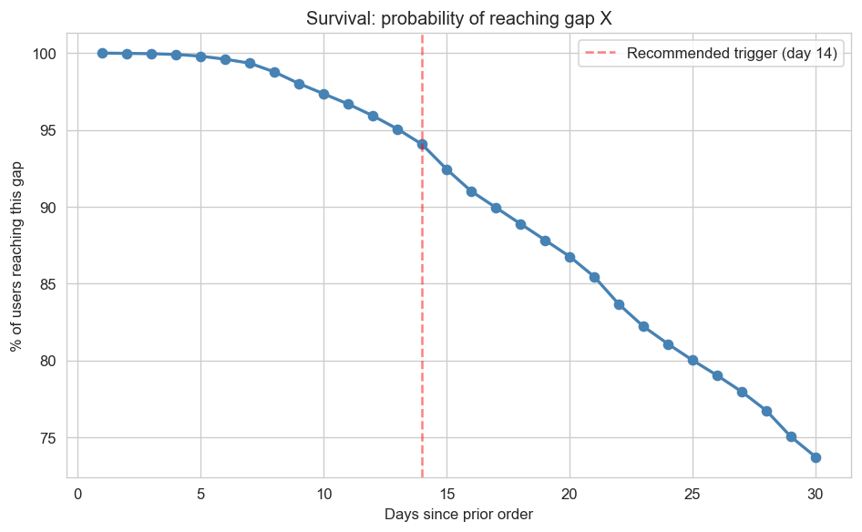
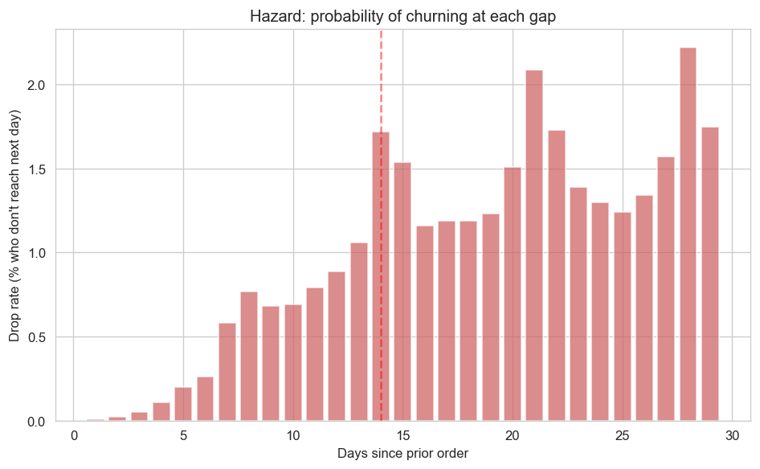
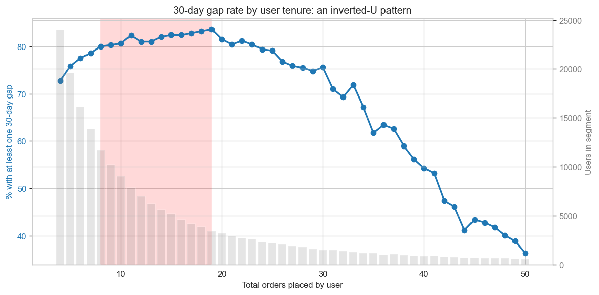

# Win-Back Trigger Analysis

**Question:** Past what inter-order gap does a user become unlikely to return — and should the trigger threshold be segmented by user tenure?

**Dataset:** 3.4M orders, 206k users (Instacart Market Basket Analysis, public)
**Stack:** Python · DuckDB · SQL · pandas · matplotlib · Streamlit

---

## Headline finding

A single global win-back threshold is the wrong intervention design. The data shows two distinct patterns that should drive a *segmented* trigger strategy:

1. **When users disappear:** churn risk climbs gradually from day 7 onwards, with no sharp inflection. Day 14 is a defensible starting threshold — the first gap where the daily hazard rate exceeds 1%.
2. **Who disappears:** the 30-day-gap rate follows an *inverted-U* across user tenure. Users with 8–19 lifetime orders are at the highest risk (peaking at 82–85%), not the lightest or heaviest users.

The combination implies: **trigger aggressive win-back at day 14, but only for users in the 8–19 order band.** Light users need better onboarding instead; heavy users self-recover and don't need intervention.

---

## Method

For every user, the analysis tracks the maximum `days_since_prior_order` observed across their order history. A user with at least one gap of *X* days "reached gap *X*." Aggregating across the 206k user base produces an empirical survival curve over inter-order gaps from 1 to 30 days.

The hazard rate at each gap — the conditional probability that a user who reached gap *X* does *not* reach gap *X+1* — surfaces where attrition risk concentrates. Tenure segmentation (light: ≤5 orders, medium: 6–20, heavy: 21+) cross-cuts the survival analysis to test whether the trigger should differ by user maturity.

---

## Results

### 1. The survival curve has no clean elbow




Drop rate climbs gradually from day 7 onwards. Multiple candidate inflection points (days 14, 20, 21, 28) cluster within 0.1 percentage points of each other in delta-of-drop-rate — there is no single dominant elbow in the observable range. **Day 14 is selected as a conservative starting hypothesis**, being the first gap where:
- Hazard rate exceeds 1% per day
- Continuation rate falls below 99%

At day 14, ~194k users (94% of the base) have hit the trigger gap, of whom ~22% will not return within the remaining observation window.

### 2. The danger zone is 8–19 orders, not light users



The 30-day-gap rate by total user order count traces a clear inverted-U:

| User tenure | 30-day gap rate |
|---|---|
| 4 orders | 72.7% |
| 8–19 orders (peak) | **82–85%** |
| 25 orders | 75.6% |
| 35 orders | ~63% |
| 50 orders | ~36% |

This rules out a denominator artifact (more orders ≠ more chances to record a 30-day gap, since the curve *declines* past 20 orders). The 8–19 order band represents users who are partway through habit formation but not yet locked in — the highest-leverage retention target.

---

## Recommendation

| Segment | Trigger threshold | Rationale |
|---|---|---|
| **Light (≤7 orders)** | None — invest in onboarding | Most are trialists, not at-risk users; win-back is wasted spend |
| **Medium (8–19 orders)** | Aggressive win-back at day 14 | Habit-forming users at real risk; interventions have highest expected lift |
| **Heavy (20+ orders)** | Light-touch reminder at day 21+ if anything | Self-recovering; aggressive nudges risk signal-jamming |

---

## Limitations

This analysis surfaces a hypothesis worth testing, not a production-ready decision. Honest constraints:

- **Right-censoring at 30 days.** Instacart caps `days_since_prior_order` at 30. A user with a "30-day gap" might have returned on day 31 or vanished forever — the data cannot distinguish them. The tail of the survival curve is fundamentally unobserved.
- **Max-gap-per-user is a proxy.** A loyal user who paused once for 14 days and then ordered 50 more times is treated identically to a user who paused for 14 days and never returned. A proper Kaplan-Meier survival framework on per-order intervals would resolve this conflation.
- **Dataset characteristics.** US Instacart, 2017, single grocery vertical. Generalization to other quick-commerce categories — or to India 2026 specifically — requires re-running on local data.
- **High-tenure sample sizes are small.** Users with 30+ orders have n in the low thousands per tenure value, so the right side of the inverted-U is noisier than the left.

---

## Next steps

1. **A/B test** day-7 vs day-14 vs day-21 triggers on the medium-tenure segment to pin down the actual optimal threshold under intervention
2. **Re-run** on uncapped timestamp data using the `lifelines` or `scikit-survival` Kaplan-Meier estimator for a production-grade churn curve
3. **Test creative variations** (push vs. email vs. WhatsApp; discount vs. reminder) within the chosen trigger window
4. **Segment further** — within the 8–19 order band, do basket-composition signatures predict which subset is most responsive to win-back?

---

## Reproduce

```bash
# 1. Clone the repo and download Instacart Market Basket Analysis from Kaggle into data/
# 2. Setup
conda create -n instacart python=3.11 -y
conda activate instacart
pip install -r requirements.txt

# 3. Verify data load
python data_check.py

# 4. Run the notebook
jupyter notebook notebooks/analysis.ipynb

# 5. Generate static figures (requires Jupyter shut down — DuckDB file lock)
python generate_figures.py

# 6. Launch dashboard
streamlit run dashboard/app.py
```

---

## Project structure
instacart_winback/
├── data/                       # raw CSVs from Kaggle (gitignored, ~700 MB)
├── notebooks/
│   └── analysis.ipynb          # main analysis notebook
├── queries/
│   └── return_probability.sql  # survival curve SQL
├── dashboard/
│   └── app.py                  # Streamlit dashboard
├── figures/                    # exported PNGs
├── data_check.py               # data load sanity check
├── generate_figures.py         # regenerate static figures
├── results.json                # serialized key findings
├── requirements.txt
└── README.md
---

*Analysis by Navya Agarwal · B.E. (Hons) Computer Science, BITS Pilani Goa*